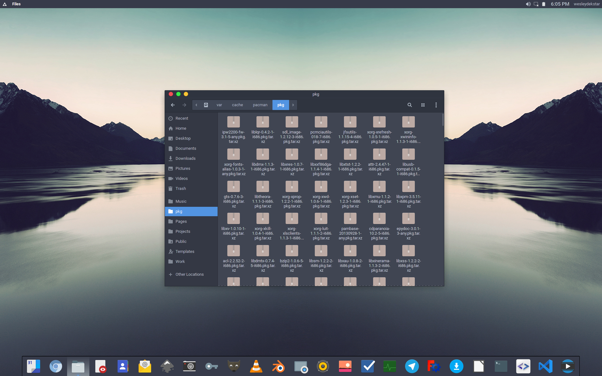
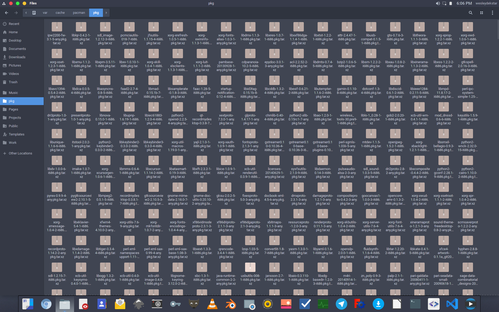
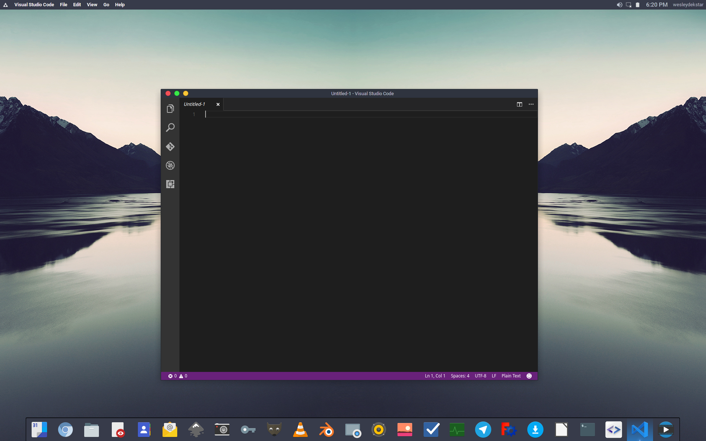
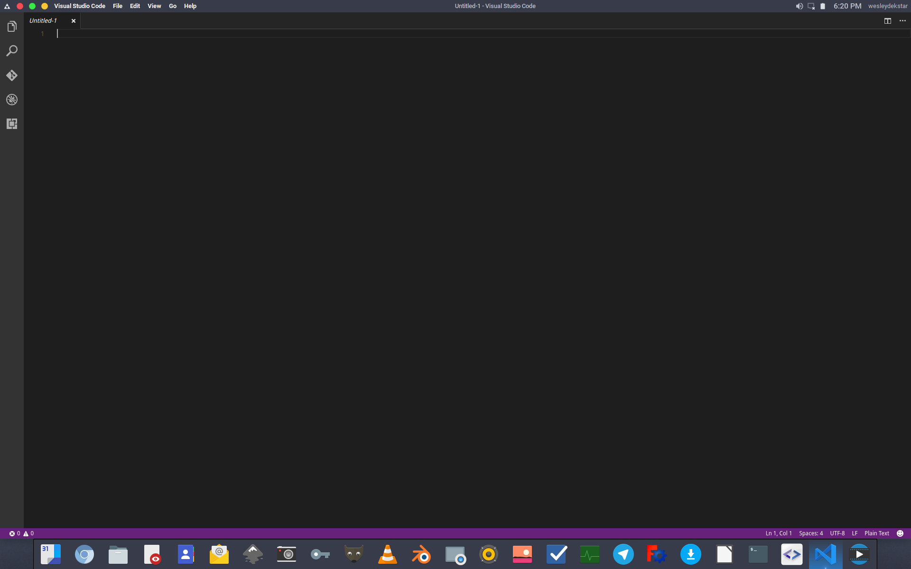
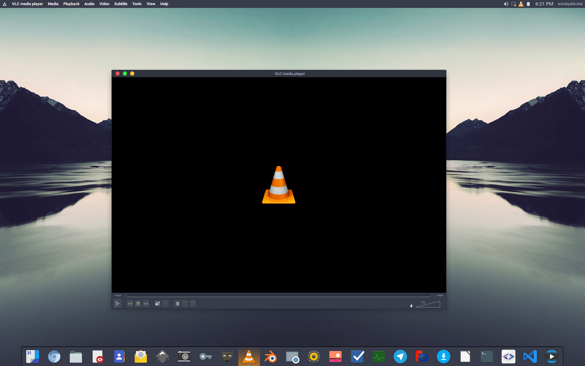
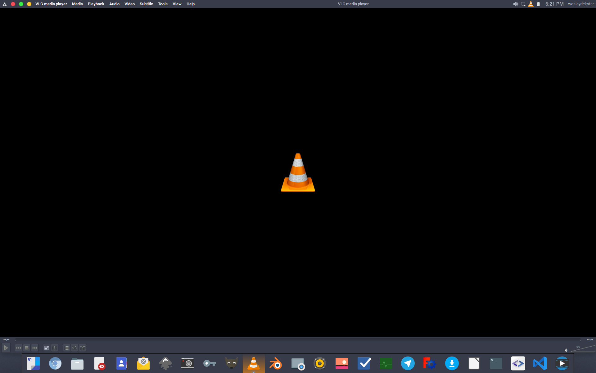
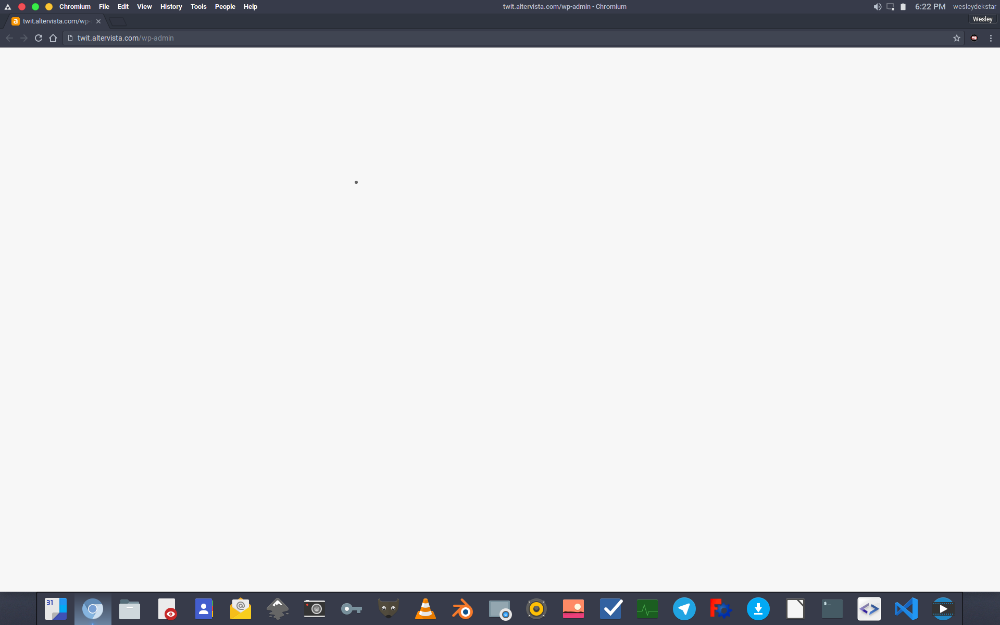
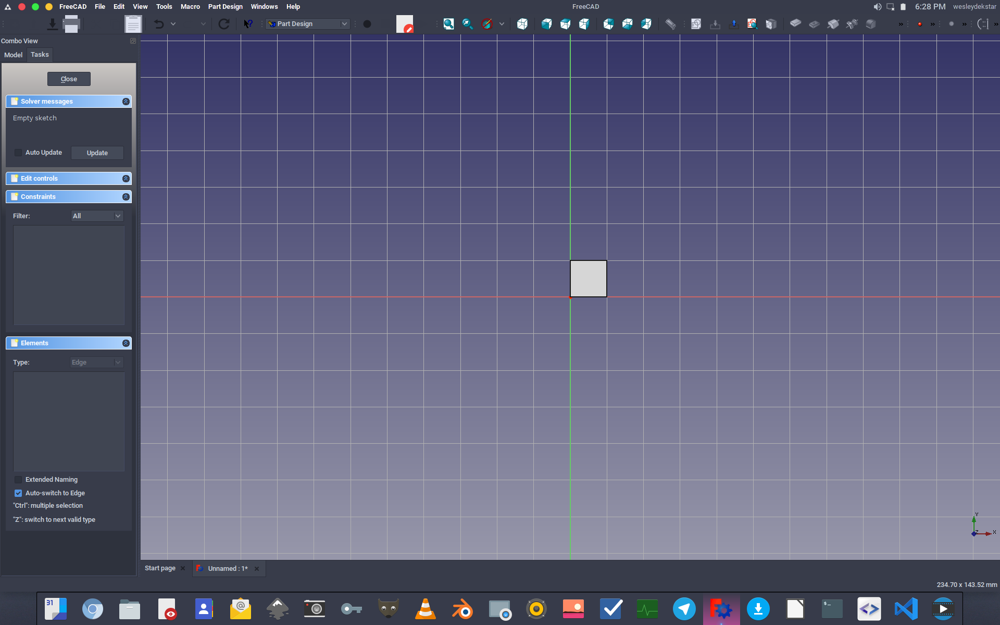
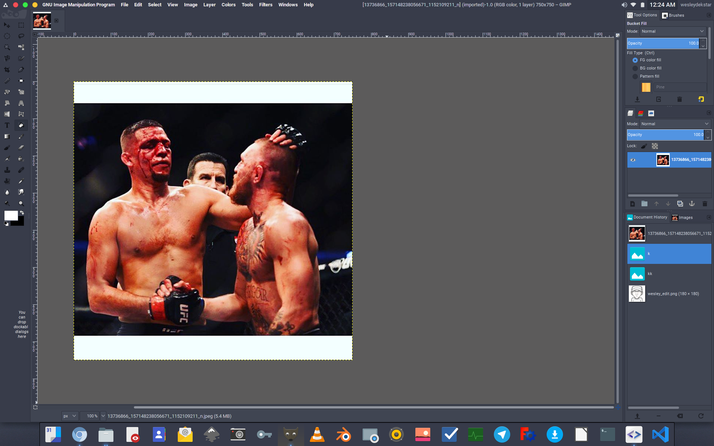

# ++What Makes My XFCE Desktop++

Here is a bunch of ooh and aah looking screenshot of the Desktop

 
 Photo: Nautilus Running *Checking my var/cache folder
 
 Photo: Nautilus Running *Checking my var/cache folder fullscreen
 
 Photo: Gnome terminal
 
 Photo: Libreoffice
 
 Photo: Gedit
 
 Photo: VScode
 
 Photo: VScode fullscreen
 
 Photo: VLC
 
 Photo: VLC fullscreen
 
 Photo: Chromium Fullscreen
 
 Photo: Chromium
 
 Photo: FreeCAD
 
 Photo: FreeCAD fullscreen
 
 Photo: GIMP running in fullscreen

* * *
